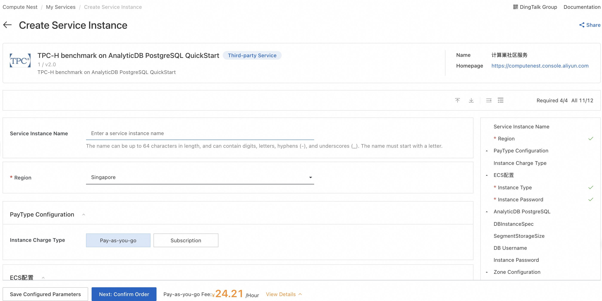
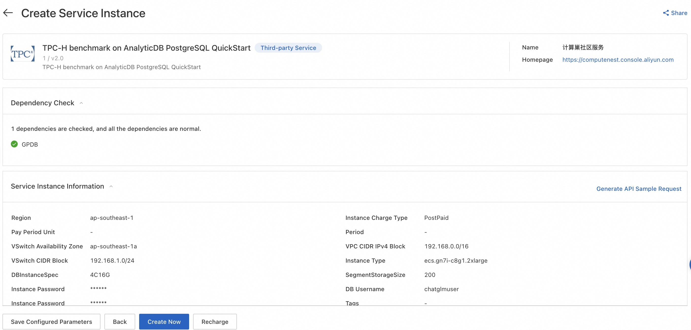
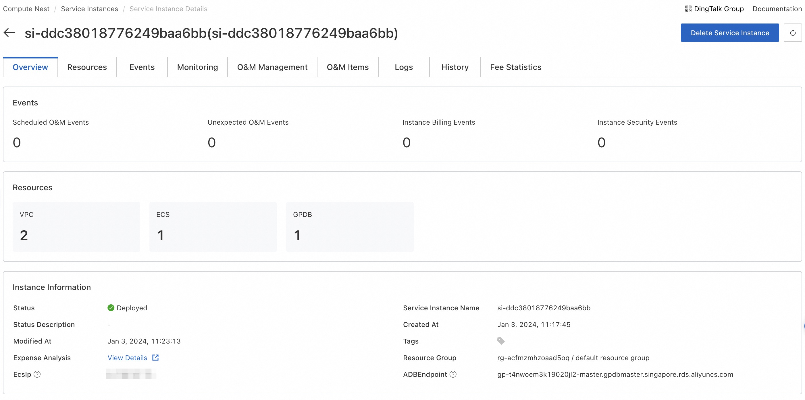

# TPC-H benchmark on GPDB

## Overview

About TPC-H
As stated in the [TPC Benchmark™ H (TPC-H)](https://www.tpc.org/tpch/?spm=a2c63.p38356.879954.3.61ad2e2azV5uLJ)
specification:

“TPC-H is a decision support benchmark. It consists of a suite of business-oriented ad hoc queries and concurrent data
modifications. The queries and the data populating the database have been chosen to have broad industry-wide relevance.
This benchmark illustrates decision support systems that examine large volumes of data, execute queries with a high
degree of complexity, and give answers to critical business questions.”

For more information,
see [TPC-H specifications](http://www.tpc.org/tpc_documents_current_versions/pdf/tpc-h_v2.17.3.pdf).

This article describes how to use Compute Nest to quickly deploy the resources required for this service.

### Deployment architecture:

## Billing instructions

The cost of this service in computing nest deployment mainly involves:

- AnalyticDB for PostgreSQL Instance
- Traffic bandwidth charges
- ECS Instance

## Permissions required

Deploying this service instance requires accessing and creating some Alibaba Cloud resources. Therefore, your account
needs to include permissions for the following resources.

**Note**: You only need to add this permission when your account is a RAM account.

| Permission policy name          | Remarks                                                                |
|---------------------------------|------------------------------------------------------------------------|
| AliyunECSFullAccess             | Permission to manage cloud server service (ECS)                        |
| AliyunVPCFullAccess             | Permission to manage private network (VPC)                             |
| AliyunROSFullAccess             | Permission to manage Resource Orchestration Service (ROS)              |
| AliyunGPDBFullAccess            | Permission to manage AnalyticDB for PostgreSQL (GPDB)                  |
| AliyunComputeNestUserFullAccess | Manage user-side permissions for the ComputeNest service (ComputeNest) |

## Deployment process

### Deployment parameter

| 参数项                       | 说明                                                                                                                                                     |
|---------------------------|--------------------------------------------------------------------------------------------------------------------------------------------------------|
| Service Instance Name     | The name can be up to 64 characters in length, and can contain digits, letters, hyphens (-), and underscores (_). The name must start with a letter.   |
| Region                    | The region where the service instance is deployed.                                                                                                     |
| Instance Charge Type      | Charge type for the service instance.                                                                                                                  |
| Instance Type             | ECS instance type                                                                                                                                      |
| Instance Password         | Server login password, Length 8-30, must contain three(Capital letters, lowercase letters, numbers, ()`~!@#$%^&*_-+=\|{}[]:;'<>,.?/ Special symbol in) |
| DBInstanceSpec            | The AnalyticDB for PostgreSQL instance spec                                                                                                            |
| SegmentStorageSize        | Segment Storage Size                                                                                                                                   |
| DB Username               | Primary account name of the database instance.                                                                                                         |
| DB Instance Password      | DB login password, Length 8-30, must contain three(Capital letters, lowercase letters, numbers, ()!@#$%&*-+= Special symbol in)                        |
| VSwitch Availability Zone | The availability zone of the VSwitch.                                                                                                                  |
| VPC CIDR IPv4 Block       | The ip address range of the VPC in the CidrBlock form.                                                                                                 |
| VSwitch CIDR Block        | Must belong to the subnet segment of VPC.                                                                                                              |

### Deployment steps

1. Visit [Deployment Link](https://computenest.console.aliyun.com/service/instance/create/cn-hangzhou?type=user&ServiceId=service-d3a86b7f3a814bdeb4f6)
and fill in the deployment parameters as prompted:
   

2. After filling in the parameters, you can see the corresponding inquiry details. After confirming the parameters,
   click **Next: Confirm Order**. After confirming the order is completed, agree to the service agreement and click *
   *Create Now** to enter the deployment stage.
   

### Validation results

After waiting for the service deployment to be successful, connect to ECS remotely and continue running TPC-H by
referring
to [Step 3 of the document](https://github.com/alibabacloud-howto/solution-adbpg-labs/blob/master/benchmark-tpc-h/README.md#step-3-generate-tpc-h-100gb-data-set-and-upload-to-oss).
   